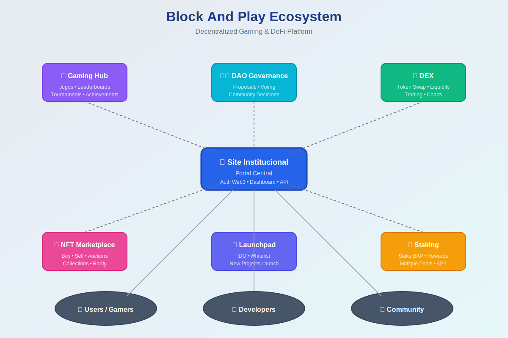

# Block And Play - Ecosystem Integrations Roadmap

Este documento descreve as integrações planejadas para o ecossistema Block And Play.

> 📖 **Veja também**: [Arquitetura Técnica](docs/arquitetura.md) para detalhes de implementação

## 🏗️ Diagrama do Ecossistema



*Visualização completa do ecossistema e suas integrações*

## 🎯 Visão Geral

O site institucional do Block And Play servirá como portal central para um ecossistema completo de dApps blockchain focados em gaming e DeFi. Esta infraestrutura permitirá:

- Autenticação Web3 unificada
- Dashboard centralizado do usuário
- Navegação fluida entre dApps
- Compartilhamento de dados e assets entre aplicações

## 🔗 Integrações Planejadas

### 1. DEX (Decentralized Exchange)

**Prioridade**: Alta  
**Estimativa**: Q1 2025

#### Funcionalidades
- Trading de tokens BAP e pares relacionados
- Pools de liquidez com APY competitivo
- Integração com múltiplas blockchains
- Charts e analytics em tempo real

#### Integração Técnica
```typescript
// Exemplo de integração
interface DEXIntegration {
  swap(tokenIn: Token, tokenOut: Token, amount: bigint): Promise<Transaction>
  addLiquidity(tokenA: Token, tokenB: Token, amounts: [bigint, bigint]): Promise<Transaction>
  getPrice(token: Token): Promise<Price>
}
```

#### Pontos de Integração
- Botão "Trade" na homepage
- Widget de preços em tempo real
- Wallet balance display
- Transaction history

---

### 2. Staking Platform

**Prioridade**: Alta  
**Estimativa**: Q1 2025

#### Funcionalidades
- Stake de tokens BAP para recompensas
- Múltiplos pools com diferentes APYs
- Lock periods flexíveis
- Auto-compound de rewards

#### Integração Técnica
```typescript
interface StakingIntegration {
  stake(amount: bigint, poolId: string): Promise<Transaction>
  unstake(amount: bigint, poolId: string): Promise<Transaction>
  claimRewards(): Promise<Transaction>
  getStakingInfo(address: string): Promise<StakingInfo>
}
```

#### Pontos de Integração
- Seção "Earn" na navegação
- Dashboard de staking no perfil
- Notificações de rewards
- Calculadora de APY

---

### 3. NFT Marketplace

**Prioridade**: Média  
**Estimativa**: Q2 2025

#### Funcionalidades
- Compra e venda de NFTs do ecossistema
- Leilões e ofertas
- Collections de jogos BAP
- Rarity rankings

#### Integração Técnica
```typescript
interface MarketplaceIntegration {
  listNFT(tokenId: string, price: bigint): Promise<Transaction>
  buyNFT(tokenId: string): Promise<Transaction>
  createAuction(tokenId: string, config: AuctionConfig): Promise<Transaction>
  getNFTMetadata(tokenId: string): Promise<NFTMetadata>
}
```

#### Pontos de Integração
- Galeria na homepage
- NFT inventory no perfil
- Notificações de vendas
- Featured collections

---

### 4. DAO Governance

**Prioridade**: Média  
**Estimativa**: Q2 2025

#### Funcionalidades
- Propostas da comunidade
- Sistema de votação on-chain
- Delegação de votos
- Treasury management

#### Integração Técnica
```typescript
interface DAOIntegration {
  createProposal(proposal: Proposal): Promise<Transaction>
  vote(proposalId: string, support: boolean): Promise<Transaction>
  delegate(to: Address): Promise<Transaction>
  getProposals(filter?: ProposalFilter): Promise<Proposal[]>
}
```

#### Pontos de Integração
- Seção "Governance" na navegação
- Propostas ativas na homepage
- Voting power no perfil
- Notificações de propostas

---

### 5. Gaming Hub

**Prioridade**: Alta  
**Estimativa**: Q1 2025

#### Funcionalidades
- Portal para todos os jogos BAP
- Leaderboards globais
- Achievements e rewards
- Torneios e eventos

#### Integração Técnica
```typescript
interface GamingHubIntegration {
  getGames(): Promise<Game[]>
  getPlayerStats(address: string): Promise<PlayerStats>
  getLeaderboard(gameId: string): Promise<Leaderboard>
  claimAchievementReward(achievementId: string): Promise<Transaction>
}
```

#### Pontos de Integração
- Seção "Games" na homepage
- Game launcher integrado
- Stats do jogador no perfil
- Sistema de achievements

---

### 6. Launchpad

**Prioridade**: Baixa  
**Estimativa**: Q3 2025

#### Funcionalidades
- IDO (Initial DEX Offering) de novos projetos
- Whitelist e tiers
- Vesting schedules
- Token distribution

#### Integração Técnica
```typescript
interface LaunchpadIntegration {
  getActiveIDOs(): Promise<IDO[]>
  participate(idoId: string, amount: bigint): Promise<Transaction>
  claimTokens(idoId: string): Promise<Transaction>
  getUserAllocation(address: string, idoId: string): Promise<Allocation>
}
```

#### Pontos de Integração
- Seção "Launchpad" na navegação
- IDOs em destaque na homepage
- Allocation info no perfil
- Countdown timers

---

## 🛠️ Arquitetura de Integração

### Autenticação Compartilhada

Todos os dApps utilizarão um sistema de autenticação Web3 compartilhado:

```typescript
// Centralized auth service
interface AuthService {
  connect(provider: WalletProvider): Promise<Session>
  disconnect(): Promise<void>
  getSession(): Session | null
  onSessionChange(callback: (session: Session | null) => void): void
}
```

### Estado Global do Usuário

Dashboard unificado com estado sincronizado:

```typescript
interface UserState {
  address: string
  balances: TokenBalance[]
  nfts: NFT[]
  stakingPositions: StakingPosition[]
  gameStats: GameStats
  governanceVotes: Vote[]
}
```

### Comunicação Entre dApps

Sistema de eventos para comunicação:

```typescript
// Event bus para comunicação entre dApps
interface EventBus {
  emit(event: string, data: any): void
  on(event: string, handler: (data: any) => void): void
  off(event: string, handler: (data: any) => void): void
}

// Exemplos de eventos
// 'wallet:connected'
// 'transaction:completed'
// 'nft:purchased'
// 'stake:created'
```

---

## 📊 Priorização e Timeline

### Q1 2025 (Alta Prioridade)
- ✅ Site Institucional (Em desenvolvimento)
- 🔲 DEX Integration
- 🔲 Staking Platform
- 🔲 Gaming Hub

### Q2 2025 (Média Prioridade)
- 🔲 NFT Marketplace
- 🔲 DAO Governance
- 🔲 Mobile App

### Q3 2025 (Baixa Prioridade)
- 🔲 Launchpad
- 🔲 Analytics Dashboard
- 🔲 Multi-chain Support

### Q4 2025 (Futuro)
- 🔲 Advanced Features
- 🔲 Third-party Integrations
- 🔲 Enterprise Solutions

---

## 🔐 Considerações de Segurança

Todas as integrações devem seguir:

1. **Auditorias de Smart Contracts**: Todos os contratos auditados por empresas reconhecidas
2. **Rate Limiting**: Proteção contra abuse de APIs
3. **Wallet Security**: Nunca armazenar private keys
4. **HTTPS**: Todas as comunicações criptografadas
5. **Input Validation**: Validação rigorosa de todas as entradas
6. **Error Handling**: Tratamento apropriado de erros sem expor dados sensíveis

---

## 📈 Métricas de Sucesso

- Número de usuários ativos mensais
- Volume de transações nos dApps
- TVL (Total Value Locked) no ecossistema
- Número de NFTs transacionados
- Participação em governança
- Engagement em jogos

---

## 🤝 Como Contribuir

Interessado em desenvolver alguma dessas integrações?

1. Revise a documentação técnica
2. Entre em contato no Discord
3. Submeta uma proposta
4. Trabalhe com a equipe core

---

## 📞 Contato

- **Discord**: Block And Play Community
- **GitHub**: [Biannolimma/bap-site](https://github.com/Biannolimma/bap-site)
- **Email**: dev@blockandplay.io

---

**Última atualização**: Dezembro 2024  
**Versão**: 1.0.0
