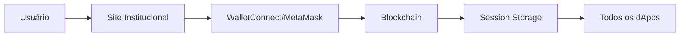

# Arquitetura do Block And Play

## 📋 Visão Geral

Este documento descreve a arquitetura técnica do site institucional Block And Play e suas integrações com o ecossistema de dApps.

## 🏗️ Estrutura Geral


O ecossistema Block And Play é composto por múltiplos componentes integrados que trabalham em conjunto para fornecer uma experiência unificada aos usuários.

## 🎯 Componentes Principais

### 1. Site Institucional (Este Repositório)

**Tecnologias:**
- Next.js 14 (App Router)
- React 18
- TypeScript 5.3
- Tailwind CSS 3.4

**Responsabilidades:**
- Portal de entrada do ecossistema
- Autenticação Web3 centralizada
- Documentação e recursos
- Dashboard unificado do usuário
- Roteamento para dApps

**Estrutura de Diretórios:**
```
bap-site/
├── app/                    # Next.js App Router
│   ├── layout.tsx         # Layout raiz com providers
│   ├── page.tsx           # Landing page
│   ├── docs/              # Documentação
│   │   └── page.tsx
│   └── login/             # Autenticação
│       └── page.tsx
├── components/            # Componentes reutilizáveis
├── public/                # Assets estáticos
│   ├── images/           # Imagens e mockups
│   └── diagrams/         # Diagramas técnicos
├── docs/                 # Documentação técnica
└── styles/               # Estilos globais
```

### 2. Gaming Hub

Portal centralizado para jogos do ecossistema.

**Funcionalidades:**
- Lista de jogos disponíveis
- Leaderboards globais
- Sistema de achievements
- Torneios e eventos

**Integração:**
```typescript
interface GamingHubAPI {
  getGames(): Promise<Game[]>
  getPlayerStats(address: string): Promise<Stats>
  getLeaderboard(gameId: string): Promise<Leaderboard>
  claimReward(achievementId: string): Promise<Transaction>
}
```

### 3. DEX (Decentralized Exchange)

Exchange descentralizada para trading de tokens BAP.

**Funcionalidades:**
- Swap de tokens
- Pools de liquidez
- Staking de LP tokens
- Charts e analytics

**Integração:**
```typescript
interface DEXIntegration {
  swap(tokenIn: Token, tokenOut: Token, amount: bigint): Promise<Tx>
  addLiquidity(tokenA: Token, tokenB: Token): Promise<Tx>
  getPrice(token: Token): Promise<Price>
}
```

### 4. NFT Marketplace

Marketplace para NFTs do ecossistema.

**Funcionalidades:**
- Compra e venda
- Leilões
- Collections
- Rarity rankings

### 5. Staking Platform

Plataforma de staking para holders ganharem rewards.

**Funcionalidades:**
- Multiple staking pools
- Flexible lock periods
- Auto-compound
- APY calculation

### 6. DAO Governance

Sistema de governança descentralizado.

**Funcionalidades:**
- Criação de propostas
- Votação on-chain
- Delegação de votos
- Treasury management

### 7. Launchpad

Plataforma para lançamento de novos projetos.

**Funcionalidades:**
- IDOs (Initial DEX Offerings)
- Whitelist system
- Vesting schedules
- Token distribution

## 🔄 Fluxo de Dados

### Autenticação Web3



**Implementação:**
```typescript
interface AuthService {
  connect(provider: WalletProvider): Promise<Session>
  disconnect(): Promise<void>
  getSession(): Session | null
  onSessionChange(callback: (session: Session) => void): void
}
```

### Estado Global do Usuário

O estado do usuário é sincronizado entre todos os dApps:

```typescript
interface UserState {
  address: string
  ens?: string
  balances: {
    native: bigint
    tokens: Record<string, bigint>
  }
  nfts: NFT[]
  stakingPositions: StakingPosition[]
  gameStats: {
    gamesPlayed: number
    achievements: Achievement[]
    totalEarnings: bigint
  }
  governance: {
    votingPower: bigint
    delegatedTo?: string
  }
}
```

### Comunicação Entre dApps

Sistema de eventos para comunicação:

```typescript
// Event Bus centralizado
interface EventBus {
  emit(event: string, data: any): void
  on(event: string, handler: (data: any) => void): void
  off(event: string, handler: (data: any) => void): void
}

// Eventos suportados:
// - wallet:connected
// - wallet:disconnected
// - transaction:pending
// - transaction:confirmed
// - transaction:failed
// - balance:updated
// - nft:purchased
// - nft:sold
// - stake:created
// - stake:withdrawn
// - vote:cast
```

## 🗄️ Camadas da Aplicação

### Camada de Apresentação

**Responsabilidade:** Interface do usuário e experiência

**Tecnologias:**
- React Components
- Tailwind CSS
- Next.js App Router

**Padrões:**
- Componentes funcionais com hooks
- Composição sobre herança
- Props drilling evitado (Context API)

### Camada de Lógica de Negócio

**Responsabilidade:** Regras de negócio e validações

**Padrões:**
- Custom hooks para lógica reutilizável
- Service layer para APIs externas
- Validação de inputs

**Exemplo:**
```typescript
// hooks/useWallet.ts
export function useWallet() {
  const [account, setAccount] = useState<string | null>(null)
  const [balance, setBalance] = useState<bigint>(0n)
  
  const connect = async () => {
    // Lógica de conexão
  }
  
  const disconnect = async () => {
    // Lógica de desconexão
  }
  
  return { account, balance, connect, disconnect }
}
```

### Camada de Dados

**Responsabilidade:** Acesso a dados e estado

**Estratégias:**
- React Context para estado global
- LocalStorage para persistência
- APIs RESTful e GraphQL
- Web3 providers para blockchain

### Camada de Integração

**Responsabilidade:** Comunicação com blockchain e dApps

**Componentes:**
- Web3 Provider (ethers.js/web3.js)
- Smart Contract ABIs
- IPFS para storage descentralizado
- The Graph para indexação

## 🔐 Segurança

### Boas Práticas Implementadas

1. **Autenticação Web3:**
   - Nunca armazenar private keys
   - Uso de WalletConnect para mobile
   - Session timeout configurável

2. **Smart Contracts:**
   - Auditorias de segurança obrigatórias
   - Upgradeable contracts com proxy pattern
   - Rate limiting e circuit breakers

3. **Frontend:**
   - Input sanitization
   - CSP (Content Security Policy)
   - XSS protection
   - CORS configurado adequadamente

4. **APIs:**
   - Rate limiting
   - Authentication tokens
   - Request validation
   - Error handling sem exposição de dados

### Checklist de Segurança

- [ ] Auditoria de smart contracts
- [ ] Testes de penetração
- [ ] Code review obrigatório
- [ ] Dependências atualizadas
- [ ] Monitoramento de vulnerabilidades
- [ ] Backup e recovery plan

## 📊 Escalabilidade

### Estratégias de Performance

1. **Frontend:**
   - Server-Side Rendering (SSR)
   - Static Site Generation (SSG)
   - Lazy loading de componentes
   - Image optimization
   - Code splitting

2. **Blockchain:**
   - Batching de transações
   - Layer 2 solutions
   - Caching de dados on-chain
   - Uso de The Graph para queries

3. **APIs:**
   - CDN para assets estáticos
   - Cache strategies (Redis)
   - Load balancing
   - Horizontal scaling

## 🧪 Testes

### Estratégia de Testes

```
Pirâmide de Testes:
    /\
   /  \  E2E Tests (Playwright)
  /____\
 /      \  Integration Tests (React Testing Library)
/________\
/__________\  Unit Tests (Jest)
```

**Cobertura mínima:** 80%

### Tipos de Testes

1. **Unit Tests:**
   - Funções utilitárias
   - Custom hooks
   - Componentes isolados

2. **Integration Tests:**
   - Fluxos de usuário
   - Interação entre componentes
   - APIs e serviços

3. **E2E Tests:**
   - Fluxos críticos completos
   - Conexão de wallet
   - Transações on-chain

## 🚀 Deploy e CI/CD

### Pipeline de Deploy

```
┌─────────────┐     ┌──────────┐     ┌─────────┐     ┌────────────┐
│   Commit    │ --> │  Build   │ --> │  Test   │ --> │   Deploy   │
│  (GitHub)   │     │  (CI)    │     │  (CI)   │     │  (Vercel)  │
└─────────────┘     └──────────┘     └─────────┘     └────────────┘
```

### Ambientes

1. **Development:** Local development
2. **Staging:** Preview deployments (PR)
3. **Production:** Main branch auto-deploy

### Monitoramento

- **Performance:** Lighthouse CI
- **Errors:** Sentry / Error tracking
- **Analytics:** Google Analytics / Mixpanel
- **Blockchain:** Etherscan, The Graph

## 📚 APIs e Integrações

### APIs Internas

**Base URL:** `https://api.blockandplay.io`

**Endpoints:**
```
GET    /api/user/:address          # User profile
GET    /api/games                  # List games
GET    /api/nfts/:collection       # NFT collection
GET    /api/staking/pools          # Staking pools
POST   /api/auth/nonce             # Get nonce for signing
POST   /api/auth/verify            # Verify signature
```

### Integrações Externas

1. **Blockchain RPCs:**
   - Infura
   - Alchemy
   - QuickNode

2. **Indexação:**
   - The Graph
   - Covalent

3. **Storage:**
   - IPFS
   - Arweave

4. **Oracles:**
   - Chainlink
   - Band Protocol

## 🔧 Configuração e Variáveis de Ambiente

```bash
# .env.example
NEXT_PUBLIC_CHAIN_ID=1
NEXT_PUBLIC_RPC_URL=https://mainnet.infura.io/v3/YOUR_KEY
NEXT_PUBLIC_GRAPH_URL=https://api.thegraph.com/subgraphs/name/...
NEXT_PUBLIC_IPFS_GATEWAY=https://ipfs.io/ipfs/
NEXT_PUBLIC_WALLETCONNECT_PROJECT_ID=YOUR_PROJECT_ID
API_SECRET=your_secret_key
```

## 📖 Referências

- [Next.js Documentation](https://nextjs.org/docs)
- [React Documentation](https://react.dev)
- [Ethereum Development](https://ethereum.org/developers)
- [Web3.js Documentation](https://web3js.readthedocs.io/)
- [Ethers.js Documentation](https://docs.ethers.io/)
- [The Graph Documentation](https://thegraph.com/docs/)

## 🤝 Contribuindo

Para contribuir com melhorias na arquitetura:

1. Leia o [CONTRIBUTING.md](../CONTRIBUTING.md)
2. Discuta mudanças significativas em issues
3. Mantenha a documentação atualizada
4. Siga os padrões de código estabelecidos

## 📞 Contato

- **Discord:** Block And Play Community
- **Email:** dev@blockandplay.io
- **GitHub:** [Biannolimma/bap-site](https://github.com/Biannolimma/bap-site)

---

**Última atualização:** Dezembro 2024  
**Versão:** 1.0.0  
**Mantido por:** Block And Play Core Team
